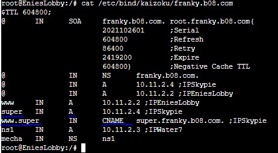
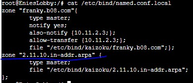

# Jarkom-Modul-2-B08-2021

Nama | NRP |
--- | --- | 
Adam Hadi Prasetyo | 05111940000224 |
Vyra Fania Adelina | 05111940000109 |
Tsania Az Zahra | 05111940000032 |

1.	EniesLobby akan dijadikan sebagai DNS Master, Water7 akan dijadikan DNS Slave, dan Skypie akan digunakan sebagai Web Server. Terdapat 2 Client yaitu Loguetown, dan Alabasta. Semua node terhubung pada router Foosha, sehingga dapat mengakses internet. 
### KONFIGURASI NODES DAN PING-TEST : semua node tersambung dengan internet dan memiliki konfigurasinya masing-masing. Setiap Client disetting nameservernya untuk mengarah pada IP EniesLobby.

EniesLobby : DNS Master

Water7 : DNS Slave

Skypie : Webserver

Loguetown X Alabasta : Client

 

Foosha : Internet-Source

2. Luffy ingin menghubungi Franky yang berada di EniesLobby dengan denden mushi. Kalian diminta Luffy untuk membuat website utama dengan mengakses franky.yyy.com dengan alias www.franky.yyy.com pada folder kaizoku.

### Mendefinisikan franky.b08.com di EniesLobby dan aliasnya menggunakan command dan syntax yang digaris bawah berwarna biru

### Hasil ping melalui client baik dengan atau tanpa alias-name franky.b08.com

3.  Setelah itu buat subdomain super.franky.yyy.com dengan alias www.super.franky.yyy.com yang diatur DNS nya di EniesLobby dan mengarah ke Skypie.

### Mendefinisikan super.franky.b08.com di EniesLobby dan aliasnya menggunakan command dan syntax yang digaris bawah berwarna biru

4. Buat juga reverse domain untuk domain utama.
   
### Tambahkan konfigurasi zone untuk reverse domain pada file named.conf.local

### Lakukan PTR ke reverse domain yang telah dibuat

.jpg)

5. 